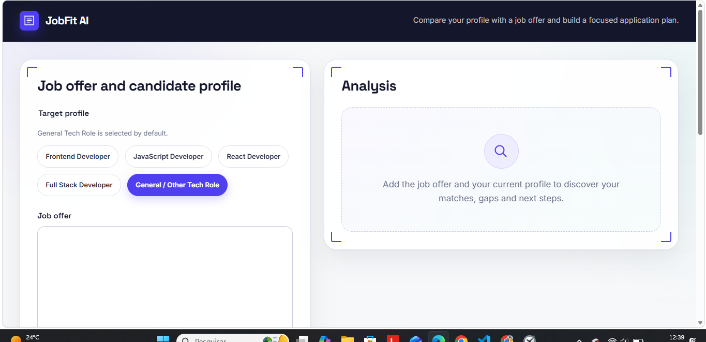
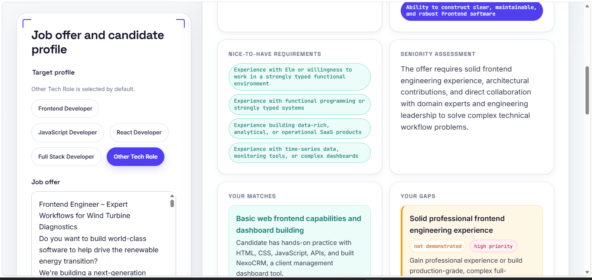
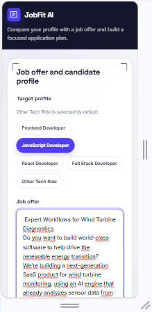

# JobFit AI

**Compare your profile with a job offer and build a focused application plan.**

JobFit AI is a small full-stack web app that takes a job offer and a candidate's own profile, and turns the comparison into a structured, actionable analysis — what you already match, what's genuinely missing versus simply not mentioned, and what to do next. It's a portfolio project, built end-to-end (frontend, backend, AI integration) to demonstrate practical product thinking as much as code.

> Not affiliated with any job board. Built as a learning/portfolio project.

---

## Table of contents

- [The problem](#the-problem)
- [Screenshots](#screenshots)
- [Features](#features)
- [How it works](#how-it-works)
- [Tech stack](#tech-stack)
- [Architecture](#architecture)
- [Project structure](#project-structure)
- [Getting started](#getting-started)
- [Environment variables](#environment-variables)
- [AI integration, at a high level](#ai-integration-at-a-high-level)
- [Product decisions worth knowing about](#product-decisions-worth-knowing-about)
- [Known limitations](#known-limitations)
- [Future improvements](#future-improvements)

---

## The problem

Reading a job offer and guessing whether you're a good fit is hard — offers mix real requirements with wish-list items, and it's easy to either overestimate your chances or talk yourself out of applying over a single "nice to have." JobFit AI removes the guesswork: it reads the offer and your own profile side by side and tells you, in plain language, what's solid, what's a real gap, and what's simply not shown yet in what you wrote.

## Screenshots

<table>
  <tr>
    <td align="center">
      <strong>Empty state</strong><br>
      
    </td>
    <td align="center">
      <strong>Analysis result</strong><br>
      
    </td>
  </tr>
</table>

<p align="center">
  <strong>Mobile view</strong>
</p>

<p align="center">
  
</p>

## Try it with sample data

Don't have a job offer handy? Copy these examples into the live demo.

### Job offer

Junior Frontend Developer

We are looking for a junior frontend developer with solid knowledge of
HTML, CSS and JavaScript. Experience with React and Git is required.
The candidate should understand responsive design and REST APIs.

Nice to have:
- TypeScript
- Testing with Vitest or Jest
- Basic knowledge of CI/CD

### Candidate profile

Junior frontend developer with projects built using HTML, CSS and
JavaScript. Comfortable with Git and GitHub, responsive layouts and
consuming REST APIs.

Built JobFit AI using vanilla JavaScript and worked with Node.js and
Express for the backend.

Currently learning React. No professional experience with TypeScript
or automated testing yet.

## Features

- Paste a job offer and your own profile (skills, projects, experience — a short CV summary works too).
- Optional target-profile chips (Frontend, JavaScript, React, Full Stack, General/Other) for extra context.
- One overall recommendation — **apply now**, **apply after preparation**, or **low fit** — with a plain-language reason, never a compatibility percentage.
- Seniority assessment of the *offer itself* (trainee, junior, mid or senior), independent of your profile.
- Must-have vs. nice-to-have requirements, clearly separated.
- Your matches, each backed by the specific evidence found in your profile.
- Your gaps, each tagged as **missing** (a real, evidenced gap) or **not demonstrated** (simply not mentioned — see [Product decisions](#product-decisions-worth-knowing-about)), with a priority and a concrete suggestion.
- An application plan: CV/LinkedIn keywords, strengths to highlight, project evidence to use, interview prep points, and what to learn first.
- Copy the whole analysis as plain text with one click.
- Your last 3 analyses are saved locally and can be reopened instantly — no re-analysis, no network call.
- Loading, error and empty states are all designed on purpose, not left as browser defaults; failed requests never wipe what you typed.

## How it works

1. You paste the **job offer** and describe **your own profile**, and optionally pick a target-role chip.
2. The frontend validates both fields client-side (non-empty, sensible length) — purely for fast feedback, never trusted as the real check.
3. The backend **independently** validates the same input (type, emptiness, length, allowed profile values) before doing anything else with it.
4. The backend builds a prompt that treats the job offer and your profile as data to analyze, not as instructions, and sends it to Gemini asking for a comparison against a strict JSON contract.
5. Gemini's response is parsed and checked against that same contract — required fields, allowed enum values (seniority level, recommendation, gap type, gap priority) — before it's ever trusted.
6. Only a validated analysis reaches the frontend, which renders it into the sections above and saves a lightweight copy (date, a short preview, and the analysis itself) to your browser's local storage.

## Tech stack

**Frontend** — plain HTML, CSS and JavaScript (ES Modules), no framework, no build step.
**Backend** — Node.js + Express 5.
**AI provider** — Google Gemini API via the official `@google/genai` SDK.
**Persistence** — `localStorage` only (no database, no accounts — see [Known limitations](#known-limitations)).

## Architecture

The app is two decoupled pieces that only ever talk over HTTP:

```
frontend/  (static files, no framework)          backend/  (Node.js + Express)
┌─────────────────────────────┐                  ┌──────────────────────────────┐
│ index.html                  │   POST            │ routes/analyze.js            │
│ js/main.js   (orchestrates) │  /api/analyze     │   → validators/…             │
│ js/api.js    (talks to the  │ ───────────────►  │   → services/geminiService.js│
│              backend only)  │                   │      → Gemini API            │
│ js/ui.js     (renders DOM)  │ ◄─────────────── │                              │
│ js/storage.js (localStorage)│   JSON response   └──────────────────────────────┘
└─────────────────────────────┘
```

A few things this is designed to guarantee:
- The **frontend never sees the Gemini API key** and never calls Gemini directly — only the backend does, and only `services/geminiService.js` knows anything provider-specific.
- `routes/analyze.js` validates and delegates; it has no AI-provider logic in it.
- The frontend renders everything with `textContent`/`createElement` — never `innerHTML` — because both the job offer and the AI's output are treated as untrusted content.
- HTTP errors handled by the Express request pipeline use a predictable JSON error shape. Unexpected server errors return a generic `500` response without exposing internal details.

## Project structure

```
jobfit-ai/
├── backend/
│   ├── server.js                        # Express app, error handling, health check
│   ├── routes/
│   │   └── analyze.js                   # POST /api/analyze — validate → delegate → respond
│   ├── validators/
│   │   ├── analyzeRequestValidator.js   # validates the incoming request
│   │   └── analysisResponseValidator.js # validates Gemini's response against the contract
│   ├── services/
│   │   ├── promptBuilder.js             # builds the (injection-resistant) Gemini prompt
│   │   └── geminiService.js             # calls Gemini, parses + validates the result
│   ├── .env.example
│   └── package.json
│
├── frontend/
│   ├── index.html
│   ├── css/
│   │   └── styles.css                   # design tokens, layout, all 4 UI states
│   └── js/
│       ├── main.js                      # orchestration: events, validation, request flow
│       ├── api.js                       # fetch() to the backend only
│       ├── ui.js                        # all DOM rendering
│       └── storage.js                   # localStorage read/write, isolated here
│
└── screenshots/
```

## Getting started

You'll run two things: the backend (Node/Express) and the frontend (static files) — separately, no build tools needed.

### 1. Backend

```bash
cd backend
npm install
cp .env.example .env
# open .env and set GEMINI_API_KEY to your own key from https://aistudio.google.com/apikey
npm run dev
```

The backend starts on `http://localhost:3000` (configurable — see below). Confirm it's up with:

```bash
curl http://localhost:3000/api/health
# {"status":"ok"}
```

### 2. Frontend

The frontend is plain static files, but it uses native ES Modules (`<script type="module">`), which browsers block from a raw `file://` path — you need to serve it, not just double-click `index.html`. Any static server works, for example:

```bash
cd frontend
npx serve .
# or, in VS Code: right-click index.html → "Open with Live Server"
```

Then open `http://localhost:5500` if you used the command above, or the URL shown by Live Server. The current frontend expects the backend to be available at `http://localhost:3000`.

That's it — paste a job offer and a profile, and analyze.

## Environment variables

Set these in `backend/.env` (copy `backend/.env.example` as a starting point). **Never commit `.env`** — it's already git-ignored.

| Variable | Required | Default | Notes |
|---|---|---|---|
| `GEMINI_API_KEY` | Yes | — | From [Google AI Studio](https://aistudio.google.com/apikey). Read only by the backend; never sent to or exposed by the frontend. |
| `PORT` | No | `3000` | Port the Express server listens on. |
| `GEMINI_MODEL` | No | `gemini-3.6-flash` | Override the Gemini model without touching code. |

## AI integration, at a high level

The backend builds a prompt with two clearly separated parts: a system instruction (JobFit AI's own rules — how to compare requirements, which values are allowed, how to write the output) and the user content (the job offer and candidate profile, wrapped in per-request random markers). Both the job offer and the candidate profile are explicitly treated as **data to analyze, never as instructions** — the prompt tells the model to disregard anything inside those markers that looks like an attempt to change its behavior, and the random marker makes it hard for pasted text to forge a fake "end of data" boundary. The response is required to be a single JSON object matching JobFit AI's contract, which the backend re-validates field by field before trusting it. The exact prompt text isn't reproduced here on purpose — the mechanism is documented, the wording isn't.

## Product decisions worth knowing about

A few choices that shaped the product, not just the code:

- **No compatibility percentage, ever.** A "78% match" sounds precise but isn't — it's a false sense of certainty about something inherently fuzzy. JobFit AI gives one of three plain recommendations (*apply now* / *apply after preparation* / *low fit*) with a written reason instead.
- **`missing` vs. `not_demonstrated` are not the same thing.** If your profile doesn't mention a requirement, that's *not* evidence you lack it — it just wasn't shown. The model is explicitly instructed to default to `not_demonstrated` and only use `missing` when your own profile gives a real signal that you lack it. This is meant to avoid the app quietly talking candidates out of applying based on silence rather than fact.
- **Seniority is assessed from the offer, not from you.** The offer's seniority level (trainee/junior/mid/senior) is judged on what it asks for, independent of how senior your own profile happens to be — the fit assessment is a separate judgment.

## Known limitations

This is a portfolio-scale MVP, and some gaps are intentional rather than oversights:

- No accounts or login — history lives in one browser's `localStorage`, not synced anywhere.
- No résumé/PDF upload — the candidate profile is pasted as plain text.
- History keeps only the 3 most recent analyses per browser.
- No automated test suite; correctness is currently verified through manual end-to-end test passes.
- English-only interface.
- Depends on the Gemini API's own availability and free-tier rate limits.
- Not deployed yet — running it means running both pieces locally (see [Getting started](#getting-started)).

## Future improvements

Ideas that were deliberately kept out of the MVP, not commitments:

- Upload a CV/résumé (PDF) instead of only pasting text.
- Multi-language support.
- Account-based history, synced across devices, beyond the 3-entry local limit.
- Export a single analysis as a PDF or shareable link.
- An automated test suite alongside the existing manual test passes.
- Paste a job posting URL instead of the raw text.
- Persist which interview-prep / learning items you've already checked off.
- Remove the optional target-profile selector and infer the role directly from the job offer.
- Rebuild the frontend with React + TypeScript as a second iteration of the project.
- Deploy the app publicly (backend and frontend hosting, with the API key kept server-side).